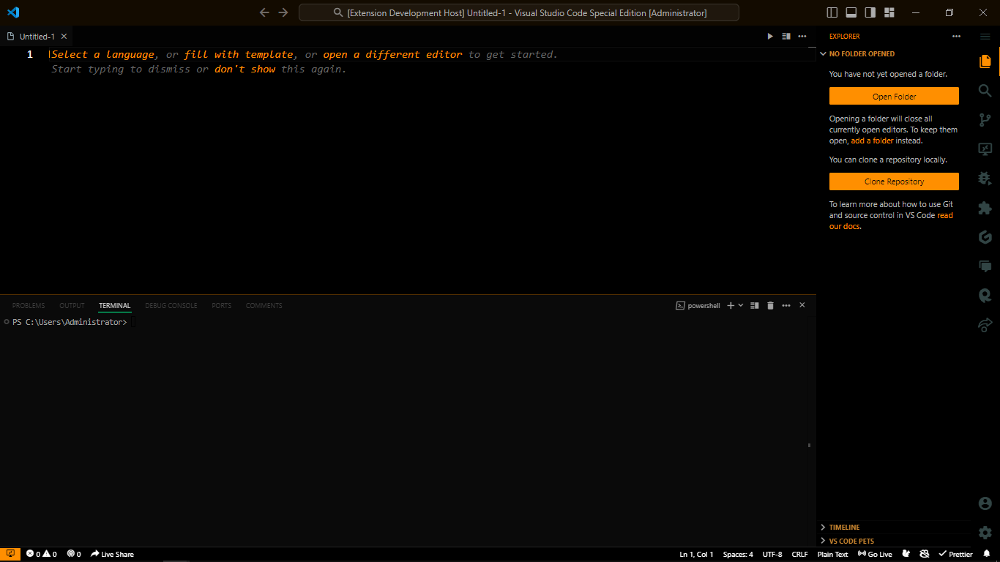
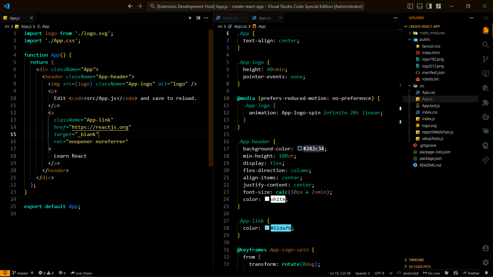
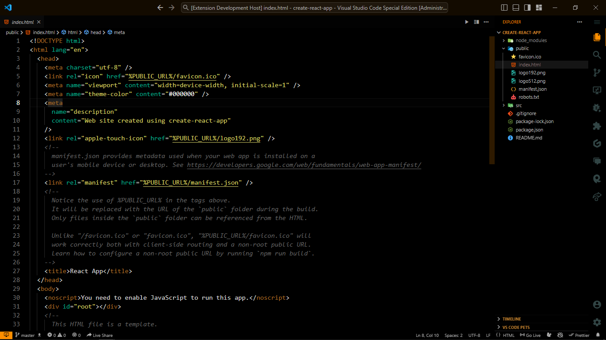
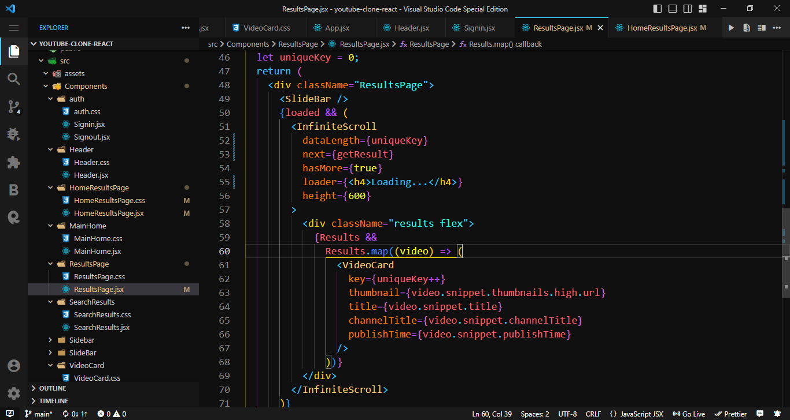
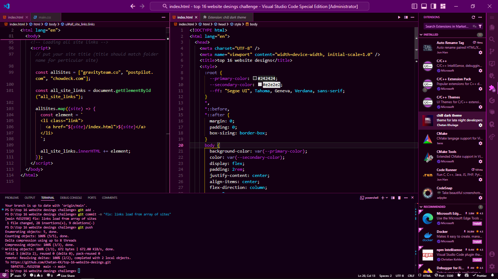
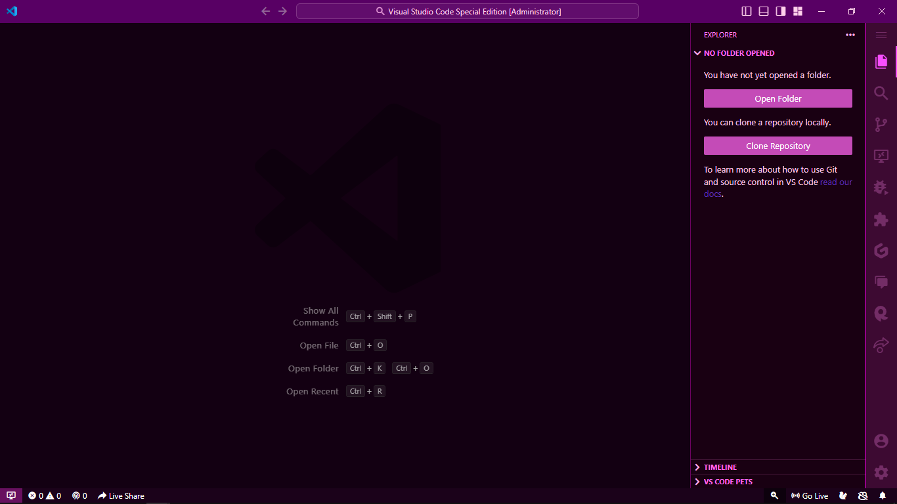

# chill-dark-theme

## Special dark theme for late night developers

---

If you're a late night developer who loves to code in a dark environment, then this theme is perfect for you! I created this minimal dark theme specifically for those who prefer a simple yet stylish look. With a sleek and sophisticated design, this theme is sure to make your coding experience more enjoyable. Unlike other themes with too many fancy colors, this one is designed to provide a clean and minimalist feel, allowing you to focus on your code without any distractions. So, if you're looking for a cool, elegant, and user-friendly theme for your vscode editor, give this one a try!

---

### Installation :

- just after installation you will get a promt on top and then click on chill dark theme

or

- click settings icon on bottom left corner and click on `Themes` > `color theme` > `chill dark theme`

or

- Press `Ctrl+k` or `Ctrl+t` and click on chill dark theme.

## Screenshots

### Orange Magic Dark Theme

- Orange magic home screen

---

- Orange magic theme with code

---

- Orange magic theme with code

---

### Main Dark Theme

- Main dark home screen

---

- Main dark theme with code

---

### Purplue Dark Theme

- Purplue dark home screen

---

- Purplue dark theme with code

---

## For more information

- [Visual Studio Code's Markdown Support](http://code.visualstudio.com/docs/languages/markdown)
- [Markdown Syntax Reference](https://help.github.com/articles/markdown-basics/)

---

## License

This project is licensed under the terms of the MIT License. See the [LICENSE](./LICENSE) file for details.

**Enjoy! this theme**
