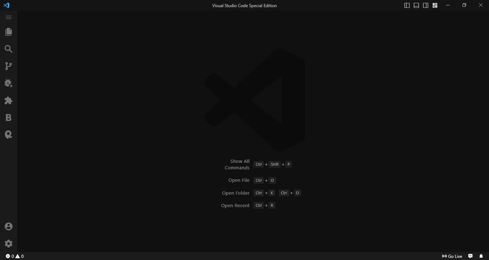

# chill-dark-theme

## Special dark theme for late night developers

---

### Installation :

- just after installation you will get a promt on top and then click on chill dark theme

or

- click settings icon on bottom left corner and click on `Themes` > `color theme` > `chill dark theme`

or

- Press `Ctrl+k` or `Ctrl+t` and click on chill dark theme.

## Screenshots

---

- home screen

---

- theme with code

---

## For more information

- [Visual Studio Code's Markdown Support](http://code.visualstudio.com/docs/languages/markdown)
- [Markdown Syntax Reference](https://help.github.com/articles/markdown-basics/)

---

## License

This project is licensed under the terms of the MIT License. See the [LICENSE](./LICENSE) file for details.

**Enjoy! this theme**
